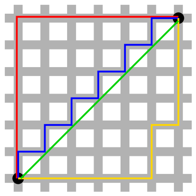
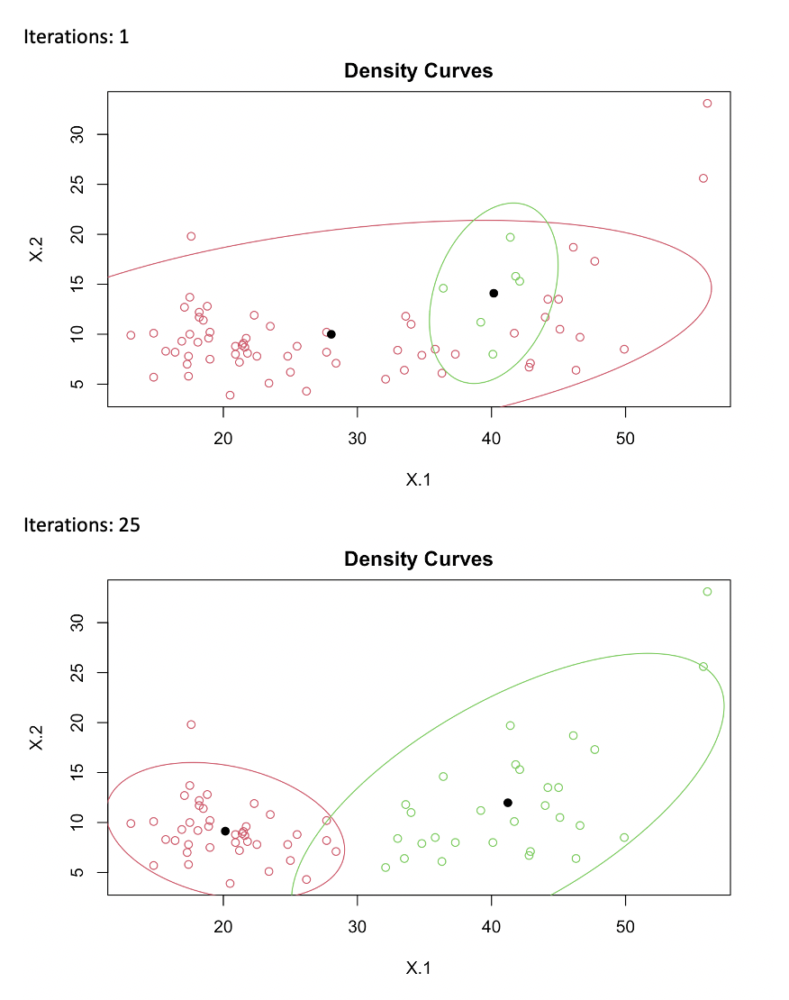
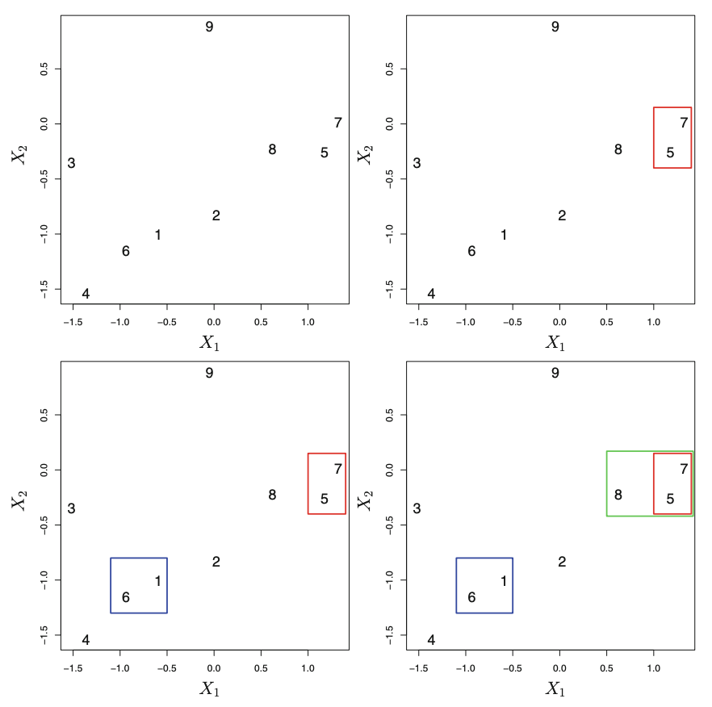
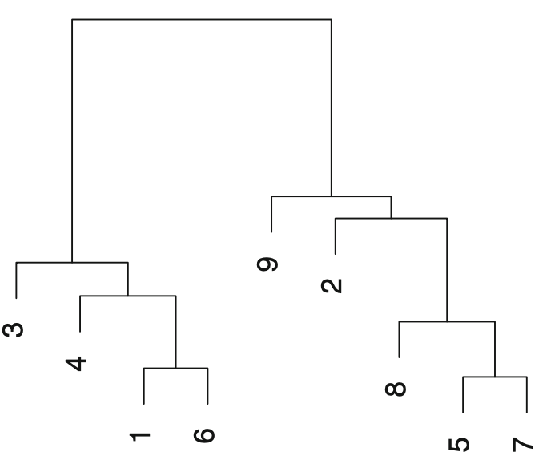

```{r global_options, include=FALSE}
knitr::opts_chunk$set(error=TRUE,        # Keep compiling upon error
                      collapse=FALSE,    # collapse by default
                      echo=TRUE,         # echo code by default
                      comment = "#>",    # change comment character
                      fig.width = 5,     # set figure width
                      fig.align = "center",# set figure position
                      out.width = "49%", # set width of displayed images
                      warning=TRUE,      # show R warnings
                      message=TRUE)      # show R messages
options(dplyr.summarise.inform = FALSE)  # ignore message about group structure
```
```{r packages, include=FALSE}

#- required functions
library(tidyverse)
library(ks)
library(mixtools)

library(cluster.datasets)
```

```{css, echo=FALSE}
.image {
  display: block;
  margin-left: auto;
  margin-right: auto;
  width: 50%;
}
```

## Introduction

## Principal Component Analysis

## Clustering

### Overview

Clustering is a unsupervised learning technique that seeks to group similar objects together. It is often used during exploratory data analysis to investigate potential patterns in data points. Although all types of clustering seek to group similar objects, the notion of how  'similarity' is defined distinguish one type of clustering algorithm from another. Three major types of clustering algorithms are$^2$:

- **Connectivity-Based Clustering**
  - Objects are  similar to closer objects rather than to far away objects.

- **Centroid-Based Clustering**
  - Objects are similar if they are close to the same centroid.

- **Distribution-Based Clustering**
  - Objects are similar if they come from the same distribution.
  
### Sample Dataset

To analyze clustering we will look at the `birth.death.rates.1966` dataset in the `cluster.datasets` R package. This package contains the birth and death rates per 1000 people for 70 countries. We can visualize this data below:

```{r include=FALSE}
data(birth.death.rates.1966)
data <- birth.death.rates.1966
birth_death_rates <- data[,c('birth','death')]
```
```{r echo=FALSE}
ggplot(data, aes(x=birth, y=death)) + geom_point() + xlab('Birth Rate per 100') + ylab('Death Rate per 100')
```

### Distance 

Regardless of the specific algorithm used, clustering often requires a notion of *distance* between objects. Because distance is used in these algorithms, it is often important to *scale* your data so that a particularly high-magnitude feature does not exert excessive influence in the clustering. There are several different types of distance metrics, and the right one to use depends on the problem at hand$^1$.

#### Euclidean Distance

$d(x,y) = \sqrt{\sum_{i=1}^n(x_i-y_i)^2}$

Euclidean Distance is often the default type of distance chosen for the problem, it simply represents the distance between two points in euclidean space.

#### Manhattan Distance

$d(x,y) = \sum_{i=1}^n\lvert(x_i-y_i)\rvert$

Manhattan Distance can be thought of as the shortest path between two points in euclidean space, with the restraint that the path can only move at right angles (similiar to a taxi car traversing a city). Manhattan Distance could be useful where the data naturally expresses distance in this format. For example, a chessboard can only be traversed in this form. The green line in the image below represents euclidean distance, and the red, blue, and yellow lines represent the shortest paths using Manhattan Distance. Image from [wikipedia](https://en.wikipedia.org/wiki/Taxicab_geometry).





#### Pearson Correlation Distance

$d(x,y) = 1 - \frac{\sum_{i=1}^n (x_i-\bar{x})(y_i-\bar{y})}{\sqrt{\sum_{i=1}^n (x_i-\bar{x})^2 \sum_{i=1}^n (y_i-\bar{y})^2}}$

Instead of a distance metric grounded in euclidean space, the Pearson Correlation Distance is a correlation-based distance: it is essentially one minus the correlation between two objects. This is useful when we want to group items together when their components follow the same pattern (i.e, when one dimension in one component is high the corresponding dimension in the other component is high, and the same for low values), but the two items may not be close in euclidean space. An example of utilizing this type of distance metric is in DNA / gene expression analysis, where we are interesting in genes that follow the same 'pattern' together$^1$.


### Centroid-Based Clustering

In Centroid-Based Clustering, each cluster is defined by a centroid: the arithmetic mean of all points in the cluster. One of the most common Centroid-Based Clustering algorithms is **K-Means Clustering**. 

#### Algorithm

The K-Means algorithm works as follows:

1. Initialize K means (centroids)
2. Assign each point to the closest mean, defined by the distance metric used.
3. Recompute the means by calculating the centroid of the updated points in that cluster.
4. Repeat steps 2. and 3. until no point assignment changes.

#### Initialization Methods

Although the iterative algorithm is fairly simple, the question remains on how to initialize the K means. There are two commonly used methods: the Forgy Method and the Random Partition.

##### Forgy Method

Randomly picks K points from the dataset to utilize as the initial K means. This often leads to initial K means that are fairly spread out$^3$.

##### Random Partition

Randomly assign each point to one of the K clusters. The centroids of these clusters are then computed and used as the initial K means. This often leads to initial K means that are close to the center of the data$^3$.

#### Number of Starts

One of the drawbacks of K-Means is that it is a *heuristic*, which means that the algorithm does not guarantee the globally optimum solution, but this allows for a computationally more efficient result. Because of this, K-Means can potentially find local optimum results that are often dependent on the initialization points. To help combat this, run K-means several times (using a random intialization method) and choose the best result (i.e, the one with the smallest within-cluster sum of squares).

#### Choice of K

As clustering is an unsupervised learning method, we do not have access to how many clusters in reality there are. However, we can estimate the number of clusters (the choice of K) several ways. One way is to inspect the data visually. For example in the scatter plot above there appears to be two main clusters of data; one could separate the data based on if the point has a birth rate greater or less than 30. Another, more analytic, option is to run K Means for a variety of K values and create a graph of the  within-cluster sum of squares vs. K. In this graph one looks for the point of diminishing returns, i.e the point where increasing the number of clusters does not significantly decrease the  within-cluster sum of squares. This is often referred to as the 'elbow' in the plot. The graph below shows how the clustering results change as we increase K for the `birth.death.rates.1966` dataset. After K = 2 or 3, the clusters appear to visually make less sense.

```{r, echo=FALSE,out.width="100%"}
#-- Run kmeans for multiple K
graphData <- tibble()
Kmax = 8                              # maximum K
SSE = numeric(Kmax)                       # initiate SSE vector
for(k in 1:Kmax){
  km = kmeans(birth_death_rates, centers=k, nstart=25)   # use 25 starts
  SSE[k] = km$tot.withinss                # get SSE
  temp <- data
  temp$num_cluster <- k
  temp$cluster <- factor(km$cluster)
  graphData <- rbind(graphData,temp)
}
p <- ggplot(graphData, aes(x=birth, y=death,color=cluster)) + geom_point()

# Use vars() to supply faceting variables:
p + facet_wrap(vars(num_cluster))
```

Additionally, we can look at the plot of SSE vs. K for the clusters above and find the same thing analytically: the 'elbow' in the plot appears at K = 2 or 3, suggesting this may be a good amount of clusters to go with.

```{r, echo=FALSE}
plot(1:Kmax, SSE, type='b', las=1, xlab="K")
```

#### Example in R

Using the `kmeans` function in R, we can easily run K-Means on our sample dataset:
```{r}
km = kmeans(birth_death_rates, centers=2, nstart=25)
```

The `kmeans` function takes in the data, the number of centers (K), and the number of starts: this is the number of times that K-Means is run, choosing the 'best' run based on the smallest within-cluster sum of squares. The resulting variable contains a vector of the cluster assignment to each point; we can plot these visually below:

```{r, echo=FALSE}
data$cluster <- factor(km$cluster)
ggplot(data, aes(x=birth, y=death,color=cluster)) + geom_point() + xlab('Birth Rate per 100') + ylab('Death Rate per 100')
```

#### Advantages and Disadvantages to K-Means

There are several advantages and disadvantages to utilizing the K-Means algorithm as opposed to other clustering techniques.

##### Advantages

- Simple
  - K-Means is simple to implement, additionally libraries already exist that implement K-Means in both R and python
- Guarantee of Convergence$^4$.
  - Although no guarantee that K-Means converged to a globally optimal solution.
- Scalability
  - Due to the heuristic nature of the algorithm, scales well to large data.

##### Disadvantages

- Choosing K
  - although there are several way to choose K, it is simply our 'best guess' of what reality is.
- Suffers with High Dimensionality
  - As is common with distance-based algorithms, as the number of features increases, the euclidean distance between points increases and the data are sparse within this volume, resulting in reduced effectiveness of K-Means.
- Outliers
  - Outliers will tend to pull the centroids of clusters, affecting the resulting clustering.
- Heuristic
  - K-Means is a heuristic, which means that we could potentially get stuck in a local optima.
- Hard Classification
  - K-Means gives us a binary answer in regards to which cluster a point belongs to. Other models, like Gaussian Mixture Models give us a probability of a point belonging to a class, which could help us quantify our uncertainty in the cluster assignment.

#### Distribution-Based Clustering

One of the disadvantages discussed above in K-Means is that points are assigned a hard classification to a single point. However, we can utilize distribution-based clustering to receive a soft-classification, or a probability, of a point belonging to a cluster. One of the main Distribution-Based Clustering algorithms is Gaussian Mixture Models. Gaussian Mixture Models treat the probability density distribution as being constructed of K different distributions$^5$:

$f(x) = \sum_{k=1}^K * \pi_k * f_k(x)$

Where $\pi_k$ represents the probability of a point coming from distribution k and $f_k(x)$ represents distribution k. Specifically in Gaussian Mixture Models, each $f_k(x)$ is a gaussian with parameters $\mu_k, \sigma^2_k$. Gaussian Mixture Models attempt to estimate two things:

1. The parameter values
    - This includes the values of each $\pi$, as well as the parameters of the gaussians:  $\mu_k, \sigma^2_k$.
2. The *responsibilities* of each data point $r_{ij}$
    - This represents the posterior probability that each data point $i$ came from each distribution $j$.
    
These values are estimated using the iterative EM algorithm. This algorithm consists of the following steps:

1. Initialize the parameters. This can be done randomly or with an intuitive guess.
2. E Step:
    - Holding the parameter values fixed, estimate the new values of the responsibilities.
3. M Step:
    - Holding the updated responsibilities fixed, estimate the new vaues for the parameters.
4. Repeat steps 2 and 3 until approximate convergence (this could be when the values in the parameters change less than a specified threshold).

```{r eval=FALSE, message=FALSE, warning=FALSE, include=FALSE}
set.seed(4)
for (iter in c(1,25,50,75,100,125)){
  #-- Fit K=2 component mixture model
GMM = mixtools::mvnormalmixEM(birth_death_rates, k=2,maxit =iter,verb=FALSE)  # use mvnormalmixEM()
#(w = GMM$lambda)           # estimated weights
#(mu = GMM$mu)              # estimate means
#(Sigma = GMM$sigma)        # estimated covariance matrix
#sapply(Sigma, det)         # determinant

#-- Plot 95% contour
plot(GMM, whichplots = 2, alpha=.05) # 95% is 1-alpha 
}
```
In practice, the EM algorithm can converge fairly quickly. Consider the output below running the EM algorithm on the `birth.death.rates.1966` data; after only 25 iterations it appears that the algorithm has captured the two clusters:


  
#### Soft Classification

As mentioned above the responsibilities calculated during the EM algorithm are *probabilities*: this provides more information than the hard classification provided by K-Means because it provides  a measure of uncertainty in our results. This is especially important at the boundary points between the two distributions, allowing us to see how confident we can be in our results.

#### Example in R

Using the `mvnormalmixEM` function in the `mixtools` library, we can easily run the EM algorithm in R:

```{r message=FALSE, warning=FALSE, paged.print=FALSE}
GMM = mixtools::mvnormalmixEM(birth_death_rates, k=2)
```
The function takes as parameters the data as well as the number of components k. We can easily plot the resulting component distributions as well.
```{r}
plot(GMM, whichplots = 2, alpha=.05) 
```

#### Advantages and Disadvantages to Gaussian Mixture Models

There are several advantages and disadvantages to utilizing Gaussian Mixture Models as opposed to other clustering techniques.

##### Advantages

- Soft Classification
  - Allows us to look at the probability of a point belonging to a class, as opposed to a hard classification
- Statistical View of Clustering$^5$.
  - Allows us to view the clustering problem as attempting to find the underlying distributions that generate the data
- Easily Interpretable.
  - Mixture Models are easy to understand as the weighted sum of different density distributions, and these distributions can be more easily visualized than K-Means.

##### Disadvantages

- Choosing K
  - Similar to K-Means, we have to choose K; it is simply our 'best guess' of what reality is.
- Stuck in Local Optima
  - Like K-Means, Gaussian Mixture Models can potentially get stuck in a local optima depending on the starting point.
- Scaling issues
  - As the number of dimensions or the number of distrubtions increases, EM can become computationally expensive.

### Connectivity-Based Clustering (Hierarchical Clustering)

Hierarchical Clustering similarly categorizes data based on distance from other points. However, where K-means has a set number of clusters, hierarchical clustering changes number of clusters depending on a threshold between 0 and some maximal value. If we had a cluster where the highest maxmial value was 1 and we chose a threshold of 0, all observations would be their own cluster. A threshold of 1 assigns all observations to 1 cluster. 

In order to utilize this threshold, we first must calculate Euclidean distance between observations. Different ways of determining these distances are called linkages. We will address that further down. As seen in K-means, we can visualize data in a scatter plot. By finding the distance between observations, we can get a good idea of where closer connections will be on a dendrogram and where clusters might make sense. In this example, 1 and 6 as well as 5 and 7 will likely be our closest pairs and therefore be our starting points. [7]



An example of a possible dendrogram for this example is seen below.[7]

```

We can now cluster our observations from the `birth.death.rates.1966` using different types of linkage. While the two main linkages are Average and Complete linkage, one can also use Single and Centroid linkage. In single linkage we find the shortest distance between two points and cluster them. From that point we find the next shortest distance. If points 1 and 2 are clustered together and 4 and 5 are clustered together on opposite sides of 3, 3 will go into the cluster containing the closest of the 4 independent points.

```{r, out.width='100%'}
data.labs = data$country
sd.h.data=scale(birth_death_rates)
h.data.dist=dist(sd.h.data)
plot(hclust(h.data.dist, method = 'single'), labels=data.labs , main="Single
Linkage ", xlab="", sub="",ylab="")
```
In complete linkage, the opposite happens. In our example with the cluster containing 1 and 2 and a cluster containing 4 and 5, 3 will go to the cluster that does not contain the independent point farthest from it. Complete linkage can be superior to single linkage where single linkage might be creating a large cluster that spans a large area and truly should have been more than one cluster but instead continually ends up being closer to each point. With complete linkage, by basing distance on the farthest point, we push the center of the cluster away and discourage unification of too many clusters.

```{r, out.width='100%'}
plot(hclust(h.data.dist), labels=data.labs , main="Complete
Linkage ", xlab="", sub="",ylab="")
```

In average linkage, we unsurprisingly take many averages. In our example above, in order to find distance, we would take the average of the distance from 3 to 2 and 3 to 1 to find the distance between the 3 cluster and the cluster containing 1 and 2. Similarly we could take the average of the distance from 3 to 4 and 3 to 5 to find the distance between the 3 cluster and the cluster containing 4 and 5. The smallest distance would determine the cluster which 3 would join. Additionally, we can find the distance between the cluster containing 1 and 2 and the cluster containing 4 and 5. This would be obtained by taking the average of the distance between 1 and 4, 1 and 5, 2 and 4, and 2 and 5. You can see from this that is the average of ALL possible individual distances.

```{r, out.width='100%'}
plot(hclust(h.data.dist, method = 'average'), labels=data.labs , main="Average
Linkage ", xlab="", sub="",ylab="")

```

Centroid linkage similarly does exactly as described. The centroids of each cluster are found and then the smallest distance between all centroids determines the next merge of clusters. In our previous example, if point 1 is at (1,3) and point 2 is at (3,1), the centroid would be at (2,2). Point 3 would be its own centroid as it is not clustered with any other point. If the centroid of 4 and 5 was at (5,5) and point 3 was at (3,3), point 3 would merge with the cluster containing 1 and 2 and the new centroid would move up and to the right. 

```{r, out.width='100%'}
plot(hclust(h.data.dist, method = 'centroid'), labels=data.labs , main="Centroid
Linkage ", xlab="", sub="",ylab="")

```

Dendrograms are a visual representation of the linkage processes. As seen above, the reason why Average and Complete Linkage are more commonly used is that it usually provides for more evenly grouped clusters at all thresholds. Below is the dendrogram of the data using complete linkage. When viewing the dendrogram below it is possible to see where these closest pairs end up. Where there is a lower split, the two observations are closer to each other and joined earlier in the linkage process. This does not mean that any adjacent observation is close to it’s adjacent observations. If a single observation connects to a group of observations, this means that the observation’s adjacency is to all of the observations in that adjacent branch in accordance to whichever linkage process took place. In higher splits, there is a higher distance between groups of observations. By setting a threshold of 2.5 in this example we produce 5 clusters. The names of the countries identified in these clusters can be viewed in the table. We can see how hierarchical clustering grouped the outliers in their own individual groups and then nicely separated the remaining countries into 3 understandable groups of high death rate/high birth rate, high birth rate/low death rate, and low borth rate/low death rate. 

```{r, out.width='100%'}
plot(hclust(h.data.dist), labels=data.labs , main="Complete
Linkage ", xlab="", sub="",ylab="")
```
```{r}
hc.out=hclust(dist(sd.h.data))
hc.clusters =cutree (hc.out ,h = 2.5)
table(hc.clusters, data.labs)
```
```{r}
ggplot(birth_death_rates, aes(birth, death)) + 
  geom_point(alpha = 0.4, size = 3.5) + geom_point(col = hc.clusters)
```


## Conclusion

## References

[1] “Clustering Distance Measures.” Datanovia, 20 Oct. 2018, www.datanovia.com/en/lessons/clustering-distance-measures/. 

[2]  Hamerly, Greg. “(PDF) Alternatives to the k-Means Algorithm That Find Better Clusterings.” ResearchGate,         www.researchgate.net/publication/221614137_Alternatives_to_the_k-means_algorithm_that_find_better_clusterings. 

[3]  Jaiswal, Sejal. “K-Means Clustering in R Tutorial.” DataCamp Community, 14 Mar. 2018, www.datacamp.com/community/tutorials/k-means-clustering-r. 

[4]  “k-Means Advantages and Disadvantages  |  Clustering in Machine Learning.” Google, Google, developers.google.com/machine-learning/clustering/algorithm/advantages-disadvantages. 

[5]  Porter, Michael. Clustering Notes, 2020, mdporter.github.io/SYS6018/lectures/06-clustering.pdf. 

[6] https://datascienceplus.com/hierarchical-clustering-in-r/

[7] https://faculty.marshall.usc.edu/gareth-james/ISL/ISLR%20Seventh%20Printing.pdf


